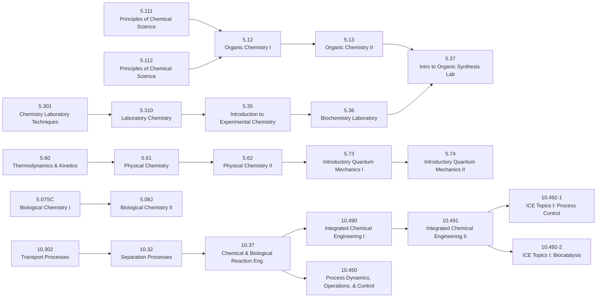
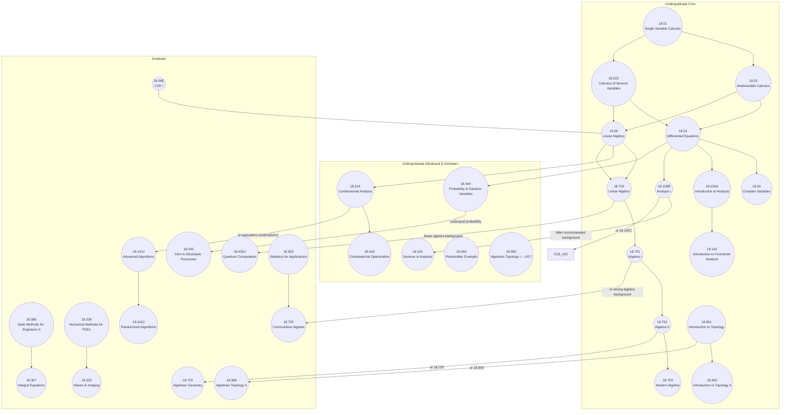

# MIT-Courses

Physics

```mermaid
flowchart TB

    %% -------------------------------
    %% UNDERGRADUATE CORE SEQUENCE
    %% -------------------------------
    subgraph Undergraduate Core
    direction TB

    %% Multiple ways to satisfy Physics I: 8.01, 8.01L, 8.012, 8.01X, 8.01SC
    A1((8.01/8.01L/8.012/8.01X/8.01SC  
     Physics I: Mechanics)):::undergrad

    %% Multiple ways to satisfy Physics II: 8.02, 8.02T, 8.02X, 8.022
    A2((8.02/8.02T/8.02X/8.022  
     Physics II: E&M)):::undergrad

    %% 8.03 or 8.03SC is Vibrations & Waves
    A3(8.03/8.03SC  
     Vibrations & Waves):::undergrad

    A4(8.04  
     Quantum Physics I):::undergrad
    A5(8.05  
     Quantum Physics II):::undergrad
    A6(8.06  
     Quantum Physics III):::undergrad

    %% Main arrows in typical order
    A1 --> A2
    A2 --> A3
    A3 --> A4
    A4 --> A5
    A5 --> A6
    end

    %% -------------------------------
    %% ADDITIONAL UNDERGRADUATE COURSES
    %% -------------------------------
    subgraph Additional Undergrad
    direction TB

    REL(8.033 Relativity 
    / 8.20 Intro to SR):::undergrad
    BH(8.224 Exploring Black Holes):::undergrad
    EUniv(8.286 The Early Universe):::undergrad
    PE(8.21 The Physics of Energy):::undergrad
    Stat1(8.044 Statistical Physics I):::undergrad
    Stat2(8.08  Statistical Physics II):::undergrad
    CM3(8.09  Classical Mechanics III):::undergrad
    EPH(8.13-14 Experimental Physics I & II Junior Lab):::undergrad
    SString(8.251 String Theory for Undergrads):::undergrad
    Ast1(8.282 Intro to Astronomy):::undergrad
    Ast2(8.284 Modern Astrophysics):::undergrad

    %% Some sample prerequisite flows
    A2 --> PE
    A3 --> EUniv
    A2 --> REL
    REL --> BH
    Stat1 --> Stat2
    A4 --> Stat1
    A5 --> EPH
    REL --> SString
    Ast1 --> Ast2
    end

    %% Connect the Additional Undergrad group to the Core group as well
    A3 --> CM3
  

    %% -------------------------------
    %% GRADUATE SEQUENCES (SAMPLE)
    %% -------------------------------
    subgraph Graduate Courses
    direction LR

    %% Quantum Theory sequence
    QTI(8.321 Quantum Theory I):::grad --> QTII(8.322 Quantum Theory II):::grad 
    QTII --> RQFTI(8.323 Relativistic QFT I):::grad 
    RQFTI --> RQFTII(8.324 Relativistic QFT II):::grad 
    RQFTII --> RQFTIII(8.325 Relativistic QFT III):::grad

    %% Statistical Mechanics
    SMI(8.333 Stat Mech I: Particles):::grad --> SMII(8.334 Stat Mech II: Fields):::grad

    %% Atomic & Optical
    AOPI(8.421 Atomic & Optical Physics I):::grad --> AOPII(8.422 A&O Physics II):::grad

    %% Condensed Matter
    TSI(8.511 Theory of Solids I):::grad --> TSII(8.512 Theory of Solids II):::grad
    MBT(8.513 Many-Body Theory):::grad --> SCS(8.514 Strongly Correlated Systems):::grad

    %% Particle / Nuclear Physics 
    PPI(8.701 Intro to Nuclear & Particle Physics):::grad --> PPII(8.811 Particle Physics II):::grad
    PPII --> EFT(8.851 Effective Field Theory):::grad --> STTP(8.871 Selected Topics in Theoretical Particle Physics):::grad

    %% Astrophysics
    AST1(8.901 Astrophysics I):::grad --> AST2(8.902 Astrophysics II):::grad

    %% Cosmology & Relativity
    COS(8.942 Cosmology):::grad
    GR(8.962 General Relativity):::grad

    %% Plasma Physics
    PL1(8.613J/22.611J  
      Intro to Plasma Physics I):::grad --> PL2(8.670J  
      Principles of Plasma Diagnostics):::grad

    %% Statistical Physics in Biology cluster
    BIO1(8.591J Systems Biology):::grad --> BIO2(8.592J Statistical Physics in Biology):::grad --> BIO3(8.594J Intro to Neural Networks):::grad
    NEURO(9.29J Intro to Comp. Neuroscience):::uggrad

    end

    %% -------------------------------
    %% CROSS-LISTED, SPECIAL TOPICS, & "RES" COURSES
    %% -------------------------------
    subgraph Additional / Special
    direction TB

    R1[RES.8-001 Applied Geometric Algebra]:::resource
    R2[RES.8-002 A WikiTextBook for Intro Mechanics]:::resource
    R3[RES.8-003 Physics Demonstration Videos]:::resource
    R4[RES.8-004 Reducing Nuclear Weapons Danger]:::grad
    R5[RES.8-005 Vibrations and Waves Problem Solving]:::resource
    R6[RES.8-007 Cosmic Origin of the Elements]:::resource
    R7[RES.8-008 Nuclear Weapons Education Project]:::resource
    R8[RES.8-009 Introduction to Oscillations Waves]:::resource
    R9[RES.8-010 Introduction to Statistical Physics ]:::resource
    TCS(5.95J Teaching College-Level Science & Engineering):::grad
    TBIO(20.416J Topics in Biophysics & Physical Biology):::grad
    STCL(8.575J/10.44J Statistical Thermodynamics of Complex Liquids):::grad
    QIS1(8.370x Quantum Information Science I):::grad --> QIS2(8.371x Quantum Information Science II):::grad
    SString2(8.821 String Theory & Holographic Duality):::grad
    CMech(12.620J Classical Mechanics: A Computational Approach):::grad
    NW(8.S271 Nuclear Weapons—History & Future):::uggrad

    end

    %% -------------------------------
    %% STYLE DEFINITIONS
    %% -------------------------------
    classDef undergrad fill:#faf399,stroke:#333,stroke-width:1px,color:#000
    classDef grad fill:#ffa9a9,stroke:#333,stroke-width:1px,color:#000
    classDef resource fill:#c9c9ff,stroke:#333,stroke-width:1px,color:#000
    classDef uggrad fill:#c9ffc9,stroke:#333,stroke-width:1px,color:#000
```

Chemistry

```mermaid
flowchart LR
    %% Chemistry Core %%

    A111[5.111<br>Principles of Chemical Science] --> A12[5.12<br>Organic Chemistry I]
    A112[5.112<br>Principles of Chemical Science] --> A12
    A12 --> A13[5.13<br>Organic Chemistry II]
    A13 --> A37[5.37<br>Intro to Organic Synthesis Lab]

    %% Chemistry Lab Sequence %%

    A301[5.301<br>Chemistry Laboratory Techniques] --> A310[5.310<br>Laboratory Chemistry]
    A310 --> A35[5.35<br>Introduction to Experimental Chemistry]
    A35 --> A36[5.36<br>Biochemistry Laboratory]
    A36 --> A37
    %% (Sometimes 5.13 is also recommended before 5.36 or 5.37)

    %% Physical/Quantum Chemistry %%

    A60[5.60<br>Thermodynamics & Kinetics] --> A61[5.61<br>Physical Chemistry]
    A61 --> A62[5.62<br>Physical Chemistry II]
    A62 --> A73[5.73<br>Introductory Quantum Mechanics I]
    A73 --> A74[5.74<br>Introductory Quantum Mechanics II]

    %% Biological Chemistry %%

    A07[5.07SC<br>Biological Chemistry I] --> A08[5.08J<br>Biological Chemistry II]

    %% Chemical Engineering (Undergraduate) %%

    B302[10.302<br>Transport Processes] --> B32[10.32<br>Separation Processes]
    B32 --> B37[10.37<br>Chemical & Biological Reaction Eng.]
    B37 --> B490[10.490<br>Integrated Chemical Engineering I]
    B490 --> B491[10.491<br>Integrated Chemical Engineering II]
    B491 --> B492A[10.492-1<br>ICE Topics I: Process Control]
    B491 --> B492B[10.492-2<br>ICE Topics I: Biocatalysis]
    %% Some curricula also have 10.450 (Process Dynamics & Control)
    B37 --> B450[10.450<br>Process Dynamics, Operations, & Control]
```

Biology

```mermaid

flowchart TB

    %% ----------------------------
    %%  FOUNDATIONAL / INTRO BIO
    %% ----------------------------
    subgraph Intro Biology
    A012[7.012<br>Intro Biology]
    A013[7.013<br>Intro Biology]
    A014[7.014<br>Intro Biology]
    A016[7.016<br>Intro Biology]
    A01SC[7.01SC<br>Fundamentals of Biology]
    end
    
    %% All Intro courses can feed into Genetics (7.03):
    A012 --> B03
    A013 --> B03
    A014 --> B03
    A016 --> B03
    A01SC --> B03
    
    %% ----------------------------
    %%  CORE UNDERGRAD
    %% ----------------------------
    B03[7.03<br>Genetics]
    B05[7.05<br>General Biochemistry]

    %% 7.02 CI (Experimental Biology - CI); 
    %% 7.15, 7.16, 7.13 are advanced lab courses in genetics / molecular bio
    B03 --> B02CI[7.02CI<br>Experimental Biology<br>]
    B03 --> B15[7.15<br>Experimental Molecular Genetics]
    B03 --> B16[7.16<br>Exp. Molecular Biology:<br>Biotech II]
    B03 --> B13[7.13<br>Experimental Microbial Genetics]
    
    %% 7.05 can come after Intro (plus some Chemistry background),
    %% but commonly 7.03 & 7.05 are "core" for advanced biology
    B03 --> B05

    %% ----------------------------
    %%  ADVANCED UNDERGRAD
    %% ----------------------------
    %% 7.08 Biological Chemistry II
    B05 --> B08[7.08J<br>Biological Chemistry II]

    %% 7.22 Dev Bio, 7.27 Human Disease,
    %% 7.29J Cellular Neurobiology
    B05 --> B22[7.22<br>Developmental Biology]
    B05 --> B27[7.27<br>Principles of Human Disease]
    B05 --> B29[7.29J<br>Cellular Neurobiology]

    %% 7.344 (Cell Metabolism & Cancer) 
    %% often requires both 7.03 & 7.05 background
    B03 --> B344[7.344<br>Cellular Metabolism & Cancer: <br>Nature or Nurture?]
    B05 --> B344

    %% Some “7.34x” special topics in biology
    %% often require 7.03 + 7.05 (and/or 7.06)
    subgraph Advanced Topics 
    T341[7.341<br>e.g. Microbes at War, Biomaterials...]
    T342[7.342<br>e.g. Immune Cell Migration, <br>Synapse Remodeling...]
    T343[7.343<br>e.g. Microbial Megaproducers, <br>Single-Molecule Imaging...]
    T344[7.344<br>Antibiotics, Toxins,<br>Protein Engineering] 
    T347[7.347<br>Epigenetic Regulation<br>of Stem Cells]
    end
    B03 --> T341
    B05 --> T341
    B03 --> T342
    B05 --> T342
    B03 --> T343
    B05 --> T343
    B03 --> T344
    B05 --> T344
    B03 --> T347
    B05 --> T347

    %% 7.18 Topics in Experimental Biology 
    %% might expect 7.02 CI + 7.03 + 7.05 background
    B02CI --> B18[7.18<br>Topics in Experimental Biology]
    B03 --> B18
    B05 --> B18

    %% 9.18 Developmental Neurobio and 9.19J Cog & Behavioral Genetics 
    %% often expect genetics and/or neuro foundations:
    B03 --> N19[9.19J<br>Cognitive & Behavioral Genetics]
    B29 --> N18[9.18<br>Developmental Neurobiology]
    
    %% Intro courses also feed into 7.30J (Ecology I) or 20.010J
    subgraph Other Undergrad
    B30[7.30J<br>Ecology I: The Earth System]
    B100[7.00<br>COVID-19, SARS-CoV-2,<br>and the Pandemic]
    C20[20.010J<br>Intro to Bioengineering]
    end
    
    A012 --> B30
    A013 --> B30
    A014 --> B30
    A016 --> B30
    A01SC --> B30

    A012 --> B100
    A013 --> B100
    A014 --> B100
    A016 --> B100
    A01SC --> B100
    
    A012 --> C20
    A013 --> C20
    A014 --> C20
    A016 --> C20
    A01SC --> C20

    %% ----------------------------
    %%  GRADUATE COURSES
    %% ----------------------------
    subgraph Graduate-Level Examples
    G88[7.88J<br>Protein Folding & Human Disease]
    G90[7.90J<br>Computational Functional Genomics]
    G91[7.91J<br>Foundations of Comp & Systems Bio]
    G92[7.92J<br>Neurology, Neuropsychology,<br>Neurobiology of Aging]
    G60[7.60<br>Cell Biology: Structure &<br>Functions of the Nucleus]
    G81[7.81J<br>Systems Biology]
    G51[7.51<br>Graduate Biochemistry]
    G547[7.547J <br>Drug Development]
    end

    %% Typically require core UG background:
    B03 --> G88
    B05 --> G88
    
    B03 --> G90
    B05 --> G90
    B03 --> G91
    B05 --> G91
    B29 --> G92
    
    B05 --> G60
    B05 --> G81
    B05 --> G51
    G51 --> G81   
    %% Grad Biochem can feed further
    
    %% Drug Development
    G547
    
    %% Teaching courses
    TTeach[5.95J<br>Teaching College-Level<br>Science & Eng.]
    B391[7.391<br>Concept-Centered Teaching ]
    subgraph Teaching
    TTeach
    B391
    end

```

Mathematics 

```mermaid
flowchart TD

    %% === UNDERGRADUATE FOUNDATIONS ===
    subgraph Undergraduate Core
    A18_01((18.01<br>Single Variable Calculus))
    A18_02((18.02<br>Multivariable Calculus))
    A18_03((18.03<br>Differential Equations))
    A18_04((18.04<br>Complex Variables))
    A18_06((18.06<br>Linear Algebra))
    A18_022((18.022<br>Calculus of Several Variables))
    A18_100A((18.100A<br>Introduction to Analysis))
    A18_100B((18.100B<br>Analysis I))
    A18_102((18.102<br>Introduction to Functional Analysis))
    A18_700((18.700<br>Linear Algebra))
    A18_701((18.701<br>Algebra I))
    A18_702((18.702<br>Algebra II))
    A18_703((18.703<br>Modern Algebra))
    A18_901((18.901<br>Introduction to Topology))
    A18_902((18.902<br>Introduction to Topology II))  
    %% Not in the list, but for illustration
    
    %% Core prereq flow
    A18_01 --> A18_02
    A18_01 --> A18_022
    A18_02 --> A18_03
    A18_022 --> A18_03
    A18_02 --> A18_06
    A18_022 --> A18_06
    A18_03 --> A18_04
    
    %% Analysis sequence
    A18_03 --> A18_100A
    A18_03 --> A18_100B
    A18_100A --> A18_102
    
    %% Algebra / Topology sequences
    A18_06 --> A18_700
    A18_700 --> A18_701
    A18_701 --> A18_702
    A18_702 --> A18_703
    A18_901 --> A18_902
    
    end

    %% === SAMPLE UPPER-LEVEL UNDERGRAD / SEMINARS ===
    subgraph Undergraduate Advanced & Seminars
    A18_104((18.104<br>Seminar in Analysis))
    A18_314((18.314<br>Combinatorial Analysis))
    A18_433((18.433<br>Combinatorial Optimization))
    A18_440((18.440<br>Probability & Random Variables))
    A18_450((18.450<br>Placeholder Example))  
    %% Not listed, for illustration
    A18_905u((18.905<br>Algebraic Topology I -- UG?)) 
    %% Actually Graduate in the list, but example
    end
    
    A18_100B -- "often recommended background" --> A18_104
    A18_06 --> A18_314
    A18_314 --> A18_433
    A18_03 --> A18_440

    %% === GRADUATE EXAMPLES ===
    subgraph Graduate
    G18_085((18.085<br>CSE I))
    G18_086((18.086<br>Math Methods for Engineers II))
    G18_307((18.307<br>Integral Equations))
    G18_325((18.325<br>Waves & Imaging))
    G18_336((18.336<br>Numerical Methods for PDEs))
    G18_415J((18.415J<br>Advanced Algorithms))
    G18_416J((18.416J<br>Randomized Algorithms))
    G18_435J((18.435J<br>Quantum Computation))
    G18_446((18.445<br>Intro to Stochastic Processes))
    G18_650((18.650<br>Statistics for Applications))
    G18_705((18.705<br>Commutative Algebra))
    G18_725((18.725<br>Algebraic Geometry))
    G18_906((18.906<br>Algebraic Topology II))
    end

    %% Illustrative grad-level prereqs
    G18_085 --- A18_06
    G18_086 --> G18_307
    G18_336 --> G18_325
    A18_314 -- "or equivalent combinatorics" --> G18_415J
    G18_415J --> G18_416J
    A18_440 -- "undergrad probability" --> G18_446
    A18_701 -- "or strong algebra background" --> G18_705
    A18_702 -- "or 18.703" --> G18_725
    A18_901 -- "or 18.904" --> G18_906
    G18_650 --> G18_705

    %% === OPTIONAL LINKS AMONG GROUPS ===
    A18_100B -- "or 18.100C" --> G18_102
    A18_06 --> A18_700
    A18_700 -- "linear algebra background" --> G18_435J
```
