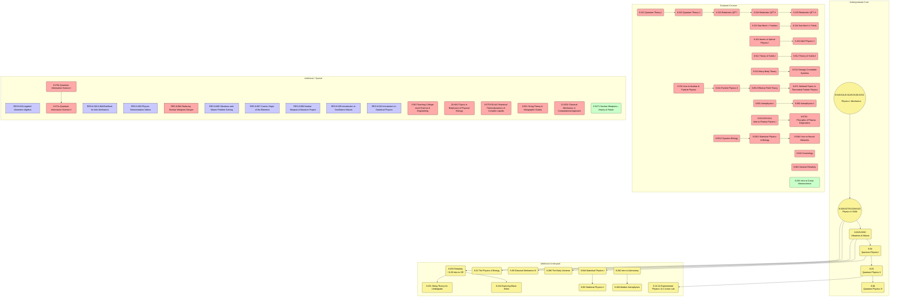

# MIT-Courses

Physics

```mermaid
flowchart TB

    %% -------------------------------
    %% UNDERGRADUATE CORE SEQUENCE
    %% -------------------------------
    subgraph Undergraduate Core
    direction TB

    %% Multiple ways to satisfy Physics I: 8.01, 8.01L, 8.012, 8.01X, 8.01SC
    A1((8.01/8.01L/8.012/8.01X/8.01SC  
     Physics I: Mechanics)):::undergrad

    %% Multiple ways to satisfy Physics II: 8.02, 8.02T, 8.02X, 8.022
    A2((8.02/8.02T/8.02X/8.022  
     Physics II: E&M)):::undergrad

    %% 8.03 or 8.03SC is Vibrations & Waves
    A3(8.03/8.03SC  
     Vibrations & Waves):::undergrad

    A4(8.04  
     Quantum Physics I):::undergrad
    A5(8.05  
     Quantum Physics II):::undergrad
    A6(8.06  
     Quantum Physics III):::undergrad

    %% Main arrows in typical order
    A1 --> A2
    A2 --> A3
    A3 --> A4
    A4 --> A5
    A5 --> A6
    end

    %% -------------------------------
    %% ADDITIONAL UNDERGRADUATE COURSES
    %% -------------------------------
    subgraph Additional Undergrad
    direction TB

    REL(8.033 Relativity 
    / 8.20 Intro to SR):::undergrad
    BH(8.224 Exploring Black Holes):::undergrad
    EUniv(8.286 The Early Universe):::undergrad
    PE(8.21 The Physics of Energy):::undergrad
    Stat1(8.044 Statistical Physics I):::undergrad
    Stat2(8.08  Statistical Physics II):::undergrad
    CM3(8.09  Classical Mechanics III):::undergrad
    EPH(8.13-14 Experimental Physics I & II Junior Lab):::undergrad
    SString(8.251 String Theory for Undergrads):::undergrad
    Ast1(8.282 Intro to Astronomy):::undergrad
    Ast2(8.284 Modern Astrophysics):::undergrad

    %% Some sample prerequisite flows
    A2 --> PE
    A3 --> EUniv
    A2 --> REL
    REL --> BH
    Stat1 --> Stat2
    A4 --> Stat1
    A5 --> EPH
    REL --> SString
    Ast1 --> Ast2
    end

    %% Connect the Additional Undergrad group to the Core group as well
    A3 --> CM3
  

    %% -------------------------------
    %% GRADUATE SEQUENCES (SAMPLE)
    %% -------------------------------
    subgraph Graduate Courses
    direction LR

    %% Quantum Theory sequence
    QTI(8.321 Quantum Theory I):::grad --> QTII(8.322 Quantum Theory II):::grad 
    QTII --> RQFTI(8.323 Relativistic QFT I):::grad 
    RQFTI --> RQFTII(8.324 Relativistic QFT II):::grad 
    RQFTII --> RQFTIII(8.325 Relativistic QFT III):::grad

    %% Statistical Mechanics
    SMI(8.333 Stat Mech I: Particles):::grad --> SMII(8.334 Stat Mech II: Fields):::grad

    %% Atomic & Optical
    AOPI(8.421 Atomic & Optical Physics I):::grad --> AOPII(8.422 A&O Physics II):::grad

    %% Condensed Matter
    TSI(8.511 Theory of Solids I):::grad --> TSII(8.512 Theory of Solids II):::grad
    MBT(8.513 Many-Body Theory):::grad --> SCS(8.514 Strongly Correlated Systems):::grad

    %% Particle / Nuclear Physics 
    PPI(8.701 Intro to Nuclear & Particle Physics):::grad --> PPII(8.811 Particle Physics II):::grad
    PPII --> EFT(8.851 Effective Field Theory):::grad --> STTP(8.871 Selected Topics in Theoretical Particle Physics):::grad

    %% Astrophysics
    AST1(8.901 Astrophysics I):::grad --> AST2(8.902 Astrophysics II):::grad

    %% Cosmology & Relativity
    COS(8.942 Cosmology):::grad
    GR(8.962 General Relativity):::grad

    %% Plasma Physics
    PL1(8.613J/22.611J  
      Intro to Plasma Physics I):::grad --> PL2(8.670J  
      Principles of Plasma Diagnostics):::grad

    %% Statistical Physics in Biology cluster
    BIO1(8.591J Systems Biology):::grad --> BIO2(8.592J Statistical Physics in Biology):::grad --> BIO3(8.594J Intro to Neural Networks):::grad
    NEURO(9.29J Intro to Comp. Neuroscience):::uggrad

    end

    %% -------------------------------
    %% CROSS-LISTED, SPECIAL TOPICS, & "RES" COURSES
    %% -------------------------------
    subgraph Additional / Special
    direction TB

    R1[RES.8-001 Applied Geometric Algebra]:::resource
    R2[RES.8-002 A WikiTextBook for Intro Mechanics]:::resource
    R3[RES.8-003 Physics Demonstration Videos]:::resource
    R4[RES.8-004 Reducing Nuclear Weapons Danger]:::grad
    R5[RES.8-005 Vibrations and Waves Problem Solving]:::resource
    R6[RES.8-007 Cosmic Origin of the Elements]:::resource
    R7[RES.8-008 Nuclear Weapons Education Project]:::resource
    R8[RES.8-009 Introduction to Oscillations Waves]:::resource
    R9[RES.8-010 Introduction to Statistical Physics ]:::resource
    TCS(5.95J Teaching College-Level Science & Engineering):::grad
    TBIO(20.416J Topics in Biophysics & Physical Biology):::grad
    STCL(8.575J/10.44J Statistical Thermodynamics of Complex Liquids):::grad
    QIS1(8.370x Quantum Information Science I):::grad --> QIS2(8.371x Quantum Information Science II):::grad
    SString2(8.821 String Theory & Holographic Duality):::grad
    CMech(12.620J Classical Mechanics: A Computational Approach):::grad
    NW(8.S271 Nuclear Weapons—History & Future):::uggrad

    end

    %% -------------------------------
    %% STYLE DEFINITIONS
    %% -------------------------------
    classDef undergrad fill:#faf399,stroke:#333,stroke-width:1px,color:#000
    classDef grad fill:#ffa9a9,stroke:#333,stroke-width:1px,color:#000
    classDef resource fill:#c9c9ff,stroke:#333,stroke-width:1px,color:#000
    classDef uggrad fill:#c9ffc9,stroke:#333,stroke-width:1px,color:#000
```
